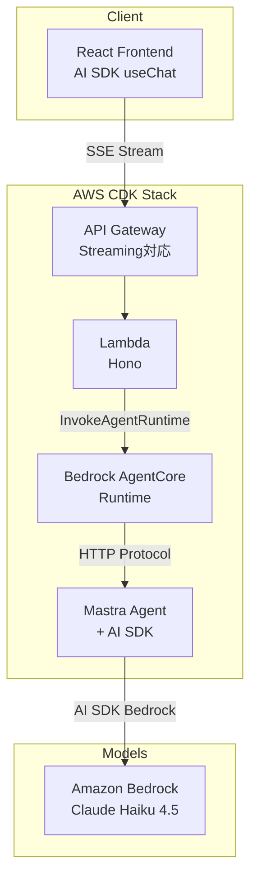

# test-agents

[](https://opensource.org/licenses/ISC)
[](https://nodejs.org/)
[](https://www.typescriptlang.org/)

## 概要

MastraエージェントをAWS Bedrock AgentCoreでマネージド実行し、AI SDK互換のストリーミングAPIを提供するモノレポプロジェクトです。

- **Mastra Framework** - TypeScript製AIエージェントフレームワーク
- **AI SDK Integration** - Vercel AI SDKでフロントエンドとシームレスに統合
- **AWS Bedrock AgentCore** - サーバーレスでスケーラブルなエージェントランタイム

## アーキテクチャ



## クイックスタート

### 前提条件

- Node.js >= 22.13.0
- AWS CLI v2（設定済み）
- AWS CDK CLI >= 2.235.1
- Bedrock Claude モデルへのアクセス権限

### セットアップ

```bash
# リポジトリのクローン
git clone <repository-url>
cd test-agents

# 依存関係のインストール
npm install

# 環境変数の設定
cp mastra/.env.example mastra/.env
cp web/.env.example web/.env
```

### ローカル開発

```bash
# AWS認証（Bedrockを使うため必須）
aws sso login --profile your-profile
export AWS_PROFILE=your-profile

# ターミナル1: Honoサーバー起動
npm run dev:serve -w mastra  # localhost:8080

# ターミナル2: フロントエンド起動
npm run dev -w web           # localhost:5173
```

`web/.env.development`に`VITE_API_URL=/invocations`を設定し、http://localhost:5173 でチャット開始。

## プロジェクト構成

```
test-agents/
├── web/                  # React + AI SDK useChat
│   ├── src/
│   │   ├── components/   # UIコンポーネント
│   │   └── App.tsx
│   └── package.json
│
├── mastra/               # Mastra Agent
│   ├── src/
│   │   ├── mastra/
│   │   │   ├── agents/   # エージェント定義
│   │   │   └── tools/    # ツール定義
│   │   └── server.ts     # Honoサーバー
│   ├── Dockerfile        # AgentCore用
│   └── package.json
│
├── cdk/                  # AWS CDK
│   ├── lib/
│   │   ├── stack.ts
│   │   └── construct/    # Agent, API Constructs
│   └── lambda/           # API Gateway Lambda
│
├── package.json          # npm workspaces
└── biome.json
```

## 開発コマンド

| ワークスペース | コマンド | 説明 |
|--------------|---------|------|
| ルート | `npx biome check --write .` | フォーマット＆リント |
| web | `npm run dev -w web` | 開発サーバー (5173) |
| web | `npm run build -w web` | ビルド |
| mastra | `npm run dev -w mastra` | Mastra Studio (4111) |
| mastra | `npm run dev:serve -w mastra` | Honoサーバー (8080) |
| mastra | `npm run build -w mastra` | ビルド |
| cdk | `npm run cdk -w cdk -- deploy` | AWSデプロイ |
| cdk | `npm run test -w cdk` | テスト |

## 環境変数

| ファイル | 変数名 | 説明 |
|---------|--------|------|
| `mastra/.env` | `PORT` | サーバーポート（デフォルト: 8080） |
| `mastra/.env` | `AWS_REGION` | AWSリージョン（デフォルト: us-east-1） |
| `web/.env.development` | `VITE_API_URL` | APIエンドポイント |

**VITE_API_URLの設定例**: Honoサーバー → `/invocations`、Mastra Studio → `/chat/agent`、AWS → `https://xxx.execute-api.../chat/stream`

## デプロイ

```bash
# CDKビルド＆デプロイ
npm run build -w cdk
npm run cdk -w cdk -- bootstrap  # 初回のみ
npm run cdk -w cdk -- deploy
```

作成されるAWSリソース:
- Bedrock AgentCore Runtime
- API Gateway（ストリーミング対応）
- Lambda（プロキシ）
- IAM Roles

## 関連リンク

- [Mastra Documentation](https://mastra.ai/docs)
- [Vercel AI SDK](https://sdk.vercel.ai/docs)
- [AWS Bedrock AgentCore](https://docs.aws.amazon.com/bedrock-agentcore/)
- [AWS CDK](https://docs.aws.amazon.com/cdk/)
- [Hono](https://hono.dev/)

## License

ISC
